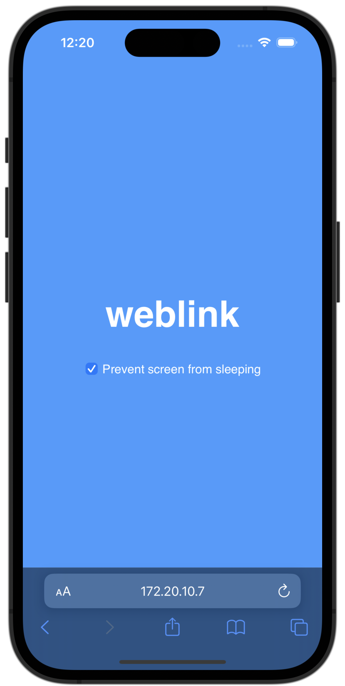

# weblink

weblink allows you to use any device with a web browser as a proxy server.
Simply start weblink and connect your device to it.



## Installation

- (Windows only) weblink requires Ruby to run. You have two options:
  A. Install [WSL](https://docs.microsoft.com/en-us/windows/wsl/install) and
  then install Ruby.
  B. Go to [rubyinstaller.org](https://rubyinstaller.org), download
  *ruby+devkit* version 2.5 or higher, and install it. Then open Command Prompt
  and follow the instructions bellow.

1. Install weblink

   ```
   gem install weblink
   ```

1. Start weblink

   ```
   weblink
   ```

1. It will output a URL that you need to open on the device you want to use
   as a proxy. Make sure that your firewall is not blocking incoming
   connections.

   Your web browser will be used as a proxy, so it must be running all the time.
   Once you connect your device to weblink, it will start a local HTTPS proxy
   server listening on port 3128, and you will need to route all traffic through
   that proxy.

1. Now weblink is ready. Change the proxy settings in your browser:

   |||
   |---|---|
   | proxy type | `HTTPS` |
   | proxy host | `127.0.0.1` |
   | proxy port | `3128` |

   It's highly recommended to let the proxy resolve domain names.

   To test it, you can run:

   ```
   curl -px http://127.0.0.1:3128 https://www.google.com/
   ```

## Development

Pull requests are welcome!

Execute `./test` to run tests.
