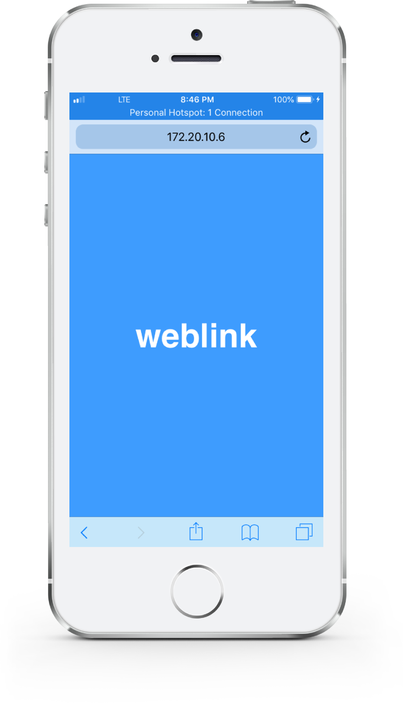

# weblink

weblink allows you to use any device that has a web browser as a proxy server.
Simply, start weblink and connect your device to it.



weblink requires ruby to run. If you are on Windows, go to rubyinstaller.org,
download *ruby+devkit* and install it. You need version 2.5 or higher. Then open
command prompt and follow the instructions bellow.

1. Install weblink

   ```
   gem install weblink
   ```

1. Start weblink

   ```
   weblink
   ```

1. weblink will output a URL that you need to open on the device you want to use
   as a proxy.

1. Now weblink is ready. Change proxy settings in your browser:

   |||
   |---|---|
   | type | `SOCKS5` |
   | host | `127.0.0.1` |
   | port | `1080` |

   It's highly recommended to let the proxy resolve domain names.

## Development

Pull requests are welcome!

Execute `./test` to run tests.
